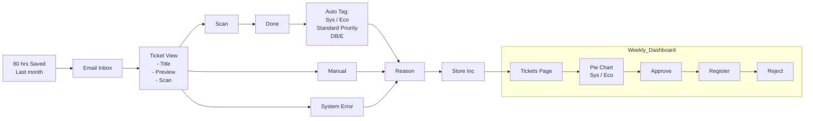

```mermaid
flowchart LR

%% =========================
%% LEFT SECTION – IMPACT
%% =========================
A["80 hrs Saved<br/>Last month"] --> B["Email Inbox"]

%% =========================
%% EMAIL PROCESSING
%% =========================
B --> C["Ticket View<br/>- Title<br/>- Preview<br/>- Scan"]

C --> E["Scan"]

%% =========================
%% DECISION FLOW
%% =========================
E --> F["Done"]

F --> G["Auto Tag:<br/>Sys / Eco<br/>Standard Priority<br/>DB/E"]

C --> H["Manual"]
C --> L["System Error"]

G --> I["Reason"]
H --> I
L --> I

I --> N["Store Inc"]

%% =========================
%% DASHBOARD
%% =========================
subgraph Weekly_Dashboard
    W1["Tickets Page"]
    W2["Pie Chart<br/>Sys / Eco"]
    W3["Approve"]
    W4["Register"]
    W5["Reject"]
end

W1 --> W2
W2 --> W3
W3 --> W4
W4 --> W5

N --> W1
```