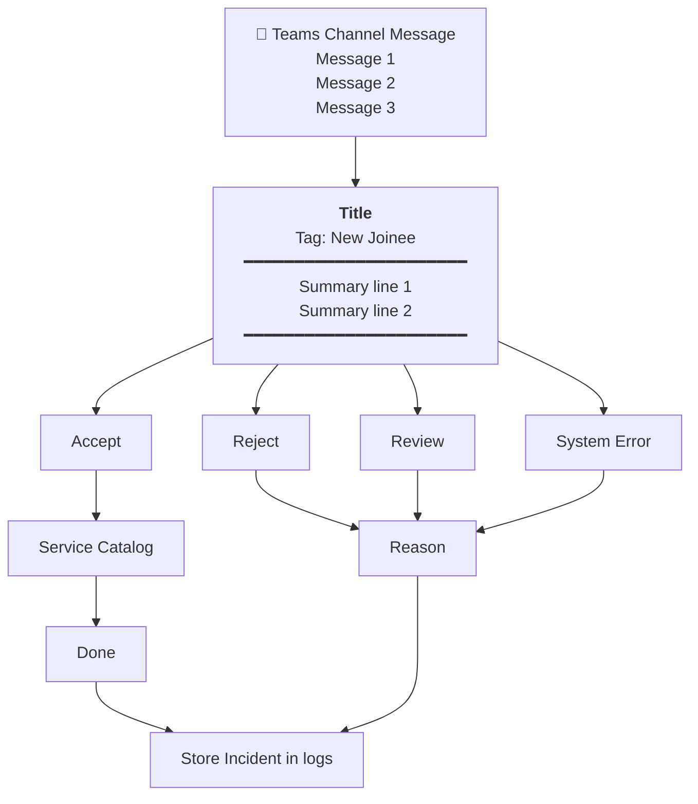
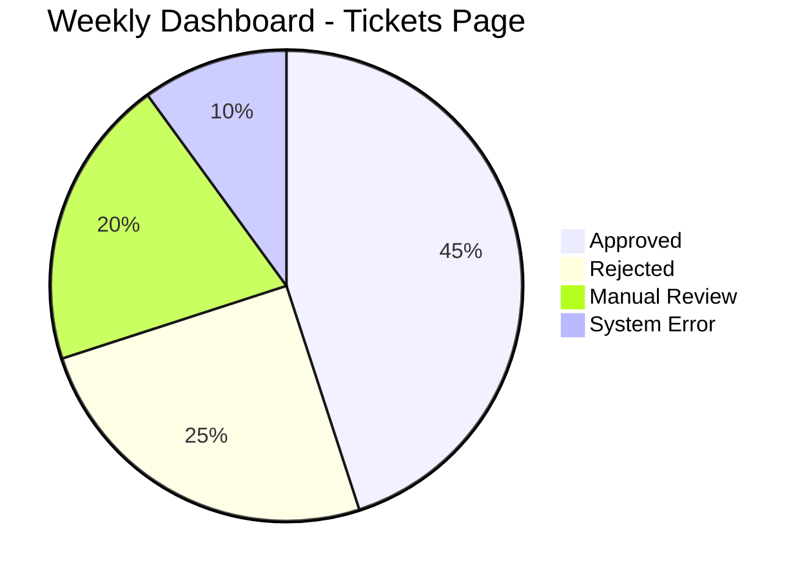
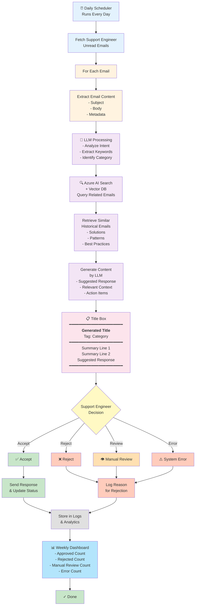

# Tech Support Email Bot - Hand-Drawn Workflow

## Main Workflow Diagram

```mermaid
graph TD
    INBOX["📧 Teams Channel Message<br/>Message 1<br/>Message 2<br/>Message 3"]
    
    EXTRACT["<b>Title</b><br/>Tag: New Joinee<br/>━━━━━━━━━━━━━━━━━━━━━━<br/>Summary line 1<br/>Summary line 2<br/>━━━━━━━━━━━━━━━━━━━━━━"]
    
    ACCEPT["Accept"]
    REJECT["Reject"]
    REVIEW["Review"]
    ERROR["System Error"]
    
    REASON1["Reason"]
    REASON2["Store Incident in logs"]
    
    DONE["Done"]
    
    PROCESS["Service Catalog"]
    
    INBOX --> EXTRACT
    EXTRACT --> ACCEPT
    EXTRACT --> REJECT
    EXTRACT --> REVIEW
    EXTRACT --> ERROR
    ACCEPT --> PROCESS
    PROCESS --> DONE
    DONE --> REASON2
    REJECT --> REASON1
    REASON1 --> REASON2
    REVIEW --> REASON1
    ERROR --> REASON1
```

## Weekly Dashboard Workflow

```mermaid
pie title Weekly Dashboard - Tickets Page
    "Approved" : 45
    "Rejected" : 25
    "Manual Review" : 20
    "System Error" : 10
```

## Main Workflow Diagram - Extended

```mermaid
graph TD
    SCHEDULER["⏰ Daily Scheduler<br/>Runs Every Day"]
    
    SCHEDULER --> FETCH["Fetch Support Engineer<br/>Unread Emails"]
    
    FETCH --> LOOP["For Each Email"]
    
    LOOP --> EXTRACT["Extract Email Content<br/>- Subject<br/>- Body<br/>- Metadata"]
    
    EXTRACT --> LLM["🧠 LLM Processing<br/>- Analyze Intent<br/>- Extract Keywords<br/>- Identify Category"]
    
    LLM --> SEARCH["🔍 Azure AI Search<br/>+ Vector DB<br/>Query Related Emails"]
    
    SEARCH --> RETRIEVE["Retrieve Similar<br/>Historical Emails<br/>- Solutions<br/>- Patterns<br/>- Best Practices"]
    
    RETRIEVE --> GENERATE["Generate Content<br/>by LLM<br/>- Suggested Response<br/>- Relevant Context<br/>- Action Items"]
    
    GENERATE --> TITLE_BOX["📋 Title Box<br/>━━━━━━━━━━━━━━━━━━━━━━<br/><b>Generated Title</b><br/>Tag: Category<br/>━━━━━━━━━━━━━━━━━━━━━━<br/>Summary Line 1<br/>Summary Line 2<br/>Suggested Response<br/>━━━━━━━━━━━━━━━━━━━━━━"]
    
    TITLE_BOX --> DECISION{"Support Engineer<br/>Decision"}
    
    DECISION -->|Accept| ACCEPT["✅ Accept"]
    DECISION -->|Reject| REJECT["❌ Reject"]
    DECISION -->|Review| REVIEW["👁️ Manual Review"]
    DECISION -->|Error| ERROR["⚠️ System Error"]
    
    ACCEPT --> PROCESS["Send Response<br/>& Update Status"]
    REJECT --> REASON["Log Reason<br/>for Rejection"]
    REVIEW --> REASON
    ERROR --> REASON
    
    PROCESS --> STORE["Store in Logs<br/>& Analytics"]
    REASON --> STORE
    
    STORE --> DASHBOARD["📊 Weekly Dashboard<br/>- Approved Count<br/>- Rejected Count<br/>- Manual Review Count<br/>- Error Count"]
    
    DASHBOARD --> DONE["✓ Done"]
    
    style SCHEDULER fill:#e3f2fd
    style FETCH fill:#e3f2fd
    style LOOP fill:#fff3e0
    style EXTRACT fill:#fff3e0
    style LLM fill:#f3e5f5
    style SEARCH fill:#f3e5f5
    style RETRIEVE fill:#f3e5f5
    style GENERATE fill:#f3e5f5
    style TITLE_BOX fill:#fce4ec
    style DECISION fill:#fff9c4
    style ACCEPT fill:#c8e6c9
    style REJECT fill:#ffccbc
    style REVIEW fill:#ffe0b2
    style ERROR fill:#ffccbc
    style PROCESS fill:#c8e6c9
    style REASON fill:#ffccbc
    style STORE fill:#e0e0e0
    style DASHBOARD fill:#b3e5fc
    style DONE fill:#c8e6c9
```
