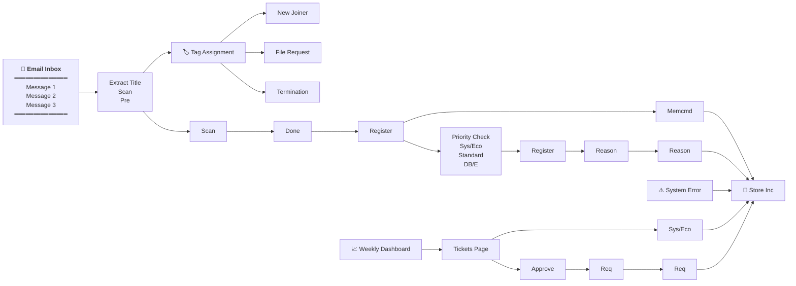

# Tech Support Email Bot - Hand-Drawn Workflow

## Main Workflow Diagram

```mermaid
graph LR
    INBOX["<b>📧 Email Inbox</b><br/>━━━━━━━━━━━━━━<br/>Message 1<br/>Message 2<br/>Message 3<br/>━━━━━━━━━━━━━━"]
    INBOX --> EXTRACT["Extract Title<br/>Scan<br/>Pre"]
    
    EXTRACT --> TAGS["🏷️ Tag Assignment"]
    TAGS --> TAG1["New Joiner"]
    TAGS --> TAG2["File Request"]
    TAGS --> TAG3["Termination"]
    
    EXTRACT --> SCAN["Scan"]
    SCAN --> DONE["Done"]
    DONE --> REG1["Register"]
    REG1 --> MEMCMD["Memcmd"]
    
    REG1 --> PRIORITY["Priority Check<br/>Sys/Eco<br/>Standard<br/>DB/E"]
    PRIORITY --> REG2["Register"]
    REG2 --> REASON1["Reason"]
    REASON1 --> REASON2["Reason"]
    
    MEMCMD --> STORE["💾 Store Inc"]
    REASON2 --> STORE
    
    ERROR["⚠️ System Error"]
    ERROR --> STORE
    
    DASHBOARD["📈 Weekly Dashboard"]
    DASHBOARD --> TICKETS["Tickets Page"]
    TICKETS --> SYSECO["Sys/Eco"]
    SYSECO --> STORE
    
    TICKETS --> APPROVE["Approve"]
    APPROVE --> REQ1["Req"]
    REQ1 --> REQ2["Req"]
    REQ2 --> STORE
```
